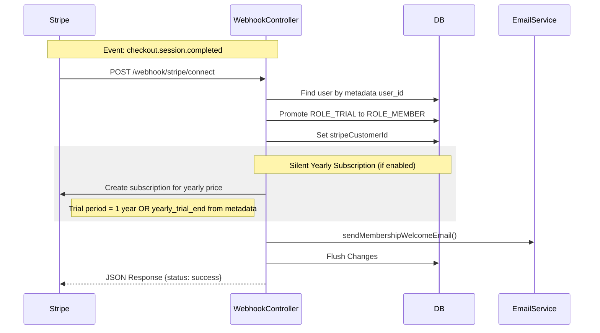

# Stripe Subscription Workflow

This document describes the Stripe Connect subscription workflow within the Phoenix Booking system, detailing how companies (trainers) onboard, how athletes subscribe, and how system roles are managed via webhooks.

---

## 1. Database Schema & Entities

The system integrates Stripe Connect using a standard connected accounts model. Each company operates its own connected Stripe account to bill its members.

### `StripeConfig` Entity
Belongs to a `Company` (One-to-One relationship) and stores the merchant credentials and prices:
- **`stripeAccountId`**: The connected Stripe account ID.
- **`stripeOnboardingComplete`**: Indicates if the company completed Stripe onboarding.
- **`stripeProductSetupFeeId`** / **`stripeProductMembershipId`**: Stripe Product resource IDs.
- **`stripePriceSetupFeeId`**: One-time Setup/Admin fee Price ID (initial checkout).
- **`stripePriceYearlyRecurringId`**: Recurring yearly Setup/Admin fee Price ID.
- **`stripePriceMembershipId`**: Recurring monthly membership Price ID.
- **`monthlyFeeAmount`** / **`setupFeeAmount`**: Locally cached pricing values in cents.
- **`billingCycleAnchorDay`**: The specific day of the month for charging members.
- **`yearlyFeeEnabled`**: Toggle indicating if the yearly administrative fee should be charged.
- **`paymentEnabled`**: Toggle indicating if membership fees are currently active.

### `User` Entity
Stores subscriber-specific metadata:
- **`stripeCustomerId`**: The Stripe Customer ID on the connected company account.
- **`roles`**: Key role transitions occur during subscriptions:
  - **`ROLE_TRIAL`**: Initial unpaid role with booking limits.
  - **`ROLE_MEMBER`**: Active paid membership allowing unlimited bookings.

---

## 2. Workflows & Controllers

### A. Company Payments Onboarding (`StripeConnectController::onboard`)
To accept payments, a Trainer (ROLE_ADMIN) must onboard their company:
1. **Account Creation**: The admin calls `/api/stripe/onboard`. If no account exists, a standard Stripe Connect account is created (`Account::create`).
2. **Onboarding Link**: The server generates an onboarding link (`AccountLink::create`) and redirects the user to Stripe.
3. **Onboarding Complete**: Once completed, Stripe redirects back to `/api/stripe/onboard/return`. The server queries the account via API, checks `details_submitted`, and marks `stripeOnboardingComplete = true`.

---

### B. Product & Price Syncing (`StripeConnectController::savePrices`)
Trainer admins configure subscription pricing inside settings:
1. **Price Creation**: Posting to `/api/stripe/prices` checks if Stripe Products/Prices exist on the connected account. If not, it creates them.
2. **Price Change Propagation**:
   - If the trainer updates the monthly price, a **new** Stripe Price is created.
   - The system automatically pages through all existing active subscriptions using `autoPagingIterator()`.
   - Each subscription is updated to point to the new price ID with `proration_behavior = always_invoice`.
   - An email notification is sent to the customer via `EmailService::sendPriceChangeNotification`.
3. **Disabling Payments**: Trainers cannot disable payments if any active or pending subscriptions exist on the connected account.

---

### C. User Checkout Session (`StripeConnectController::createCheckoutSession`)
When an athlete clicks **"Sign Contract & Pay"**:
1. **Initialize Session**: The client calls `/api/stripe/checkout`.
2. **Double Charging Check**: The controller queries Stripe to verify if the user already paid the yearly fee this year (checking if a previous active, trialing, or canceled yearly subscription has a renewal date in the future).
3. **Line Items Configuration**:
   - **Monthly Membership Fee**: Added as a recurring item using `stripePriceMembershipId`.
   - **Setup/Yearly Fee**: Added as a **one-time** setup line item (`stripePriceSetupFeeId`) **only** if the user has not yet paid the yearly fee for the current year.
4. **Billing Anchor Day**:
   - If `billingCycleAnchorDay` is set (e.g. 1st of the month), the anchor timestamp is computed (aligning to the next cycle).
   - `billing_cycle_anchor` is set inside `subscription_data` with `proration_behavior = create_prorations`.
5. **Metadata**: The checkout session includes `user_id`, the user's email, and `yearly_trial_end` (the future renewal date if they already paid this year) to pass this context to the webhook.

---

## 3. Webhook Processing (`StripeWebhookController::handleConnectWebhook`)
Stripe webhooks are configured to point to `/webhook/stripe/connect` to keep the DB in sync with Stripe.

### Event: `checkout.session.completed`
1. **Promotion**: Promotes the user from `ROLE_TRIAL` to `ROLE_MEMBER` and saves their `stripeCustomerId`.
2. **Subsequent Yearly Fees**: If the company has the yearly administrative fee enabled:
   - The system creates a secondary subscription on Stripe for the yearly price (`stripePriceYearlyRecurringId`).
   - The trial end is set to **1 year from now** by default, or the `yearly_trial_end` value from session metadata if the user has already paid it this year.
3. **Welcome Email**: Triggers `EmailService::sendMembershipWelcomeEmail` to notify the user.

### Event: `customer.subscription.deleted`
When a subscription expires or is canceled in Stripe:
1. **Identify Subscription Type**: Checks if the deleted subscription's price ID matches the company's monthly membership price ID.
2. **Clean up Active Background Subscriptions**: If it is the membership subscription, the system queries for any active background yearly recurring subscriptions (`stripePriceYearlyRecurringId`) for this customer, and automatically cancels them immediately to prevent future charges.
3. **Downgrade**: Strips the `ROLE_MEMBER` and `ROLE_TRAINER` roles from the user, and re-assigns `ROLE_TRIAL` (only if the monthly membership was the deleted subscription).
4. **Stripe Customer ID Cleanup**: Regardless of which subscription was deleted, the system queries Stripe to check if the customer has any other active or trialing subscriptions remaining. If none exist, it clears `stripeCustomerId` by setting it to `null`.

### Event: `invoice.payment_failed`
When a payment attempt fails for a subscription invoice:
1. **Identify User**: Finds the user in the database using the Stripe Customer ID (`customer` field in the invoice).
2. **Retain Member Status**: The user's role remains `ROLE_MEMBER` while Stripe attempts automatic retries (the subscription status becomes `past_due` in Stripe).
3. **Notification**: Triggers `EmailService::sendPaymentFailedEmail` to send an email notification warning the customer of the failed payment and providing a link to update their billing details.

---

## 4. Subscription Management & Cancellation

### A. Cancellation Strategies (`SubscriptionService::cancelSubscription`)
When a user clicks "Cancel Subscription" (`DELETE /api/stripe/my-subscription`), the controller delegates to `SubscriptionService`:
- **Yearly Subscriptions**: Cancelled **immediately** in Stripe.
- **Monthly Subscriptions**: Cancelled **at the end of the billing period** (sets `cancel_at_period_end = true`), allowing the user to finish their paid month.
- **Payload Response**: The endpoint returns `cancellation_type` (`immediate` vs. `period_end`) and the final `ends_at` date, which the frontend displays in a tailored PrimeVue Dialog.

### B. Reactivation/Renewal Flow (`StripeConnectController::reactivateMySubscription`)
If a user is in the "cancelling" grace period, they can click "Reactivate Subscription":
1. **Monthly Subscription**: Reactivated immediately by setting `cancel_at_period_end = false`.
2. **Yearly Subscription**: If it was already deleted (since yearly is cancelled immediately), the backend recreates it. It looks up the original renewal date of the last cancelled yearly subscription and sets it as the new `trial_end` (if in the future) so that the user is not double-charged.

---

## 5. Billing History & Invoices (`StripeConnectController::getMyInvoices`)
Athletes can view their billing history on the Abo tab:
- **Endpoint**: `GET /api/stripe/my-invoices` retrieves the last 20 invoices (`\Stripe\Invoice::all`) for the customer.
- **Data Returned**: Mapped details including invoice number, price/currency, date, description, and the direct download URL (`invoice_pdf`) hosted by Stripe.
- **Frontend UI**: Renders a premium PrimeVue `<DataTable>` with pagination and a direct download button. Controlled by `v-if="isNotProd"`, the "Manage in Stripe" link is hidden in production.
